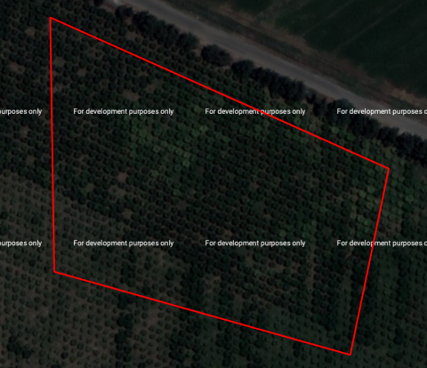

# Classification de l'occupation du sol 

Ce mini-projet à pour but d'explorer quelques possibilités de classification d'occupation du sol de la zone de Bekaa au Liban avec des images optiques et RADAR. Dans ce fichier README, seront expliquées les démarches suivies, avec quelques explications de codes présents dans les liens au-dessus.

Au delà de la recherche de résultats nous nous attacherons à présenter un cheminement intellectuel : les méthodes utilisées les résultats obtenus, mais aussi les pistes infructueuse et les difficultés rencontrées. 


## 1- Introduction

La région de la Bekaa est une zone agricole de première importante pour le Liban. Il semble donc primordiale de connaitre l'occupation du sol de la région pour quantifier et prévoir les productions et les changements auquels pourrait être soumis la région. En complément du travail de terrain et de recherche classique,la télédétection est un outils précieux dans la mesure ou elle permet d’analyser le territoire sur de large surface et à une échelle multi-temporelle. Vaste champ, la télédétection peut également s’aborder par différentes composantes comme l’optique et le RADAR ce qui permet de recouper les résultats et d’enrichir l’analyse. 
C’est dans ce contexte que s’inscrit ce mini-projet qui a pour objectif la réalisation de cartes de l’occupation du sol de la région de Bekaa en 2019 à l’aide d’images optiques (Sentinel-2) et RADAR (Sentinel-1). On tachera d'analyser et de comparer les résultats des deux types d'images séparemment mais également dans leur complémentarité.


Voici le plan suivi tout au long de ce mini-projet :

je suis meilleur dans le premier, plus facile a comparer ensuite
* Classification des images optiques
* Classification des images RADAR
* Complémentarité des deux méthodes

## 2- Les données disponibles

31 images sur 71 sont à garder sur la zone. 
### Les données de terrains
### Les images Sentinel-2
     - qu'est ce que l'imagerie optique 
     - (point positif, négatif)
     - pourquoi sentinel-2 
     
     - préparation (téléchargement, prétraitement, difficultés (problème espace, nuage, prétraitement))
     
#### Téléchargement et préparation des données

Les images Sentinel-2 sont disponibles sur plusieurs plateformes de téléchargements comme PEPS ou Sci-hub... Après les avoir télécharger en prenant en compte différents critères (le taux de nuage dans l'image...) il convient de prétraités les images et de les découpés à la taille voulut avant de les exploiter. 
Dans notre cas, le téléchargement et la préparation des données doivent nécessairement être automatisés. En effet, sur l'année 2019, 71 images de Sentinel-2 sur la zone d'étude étaient disponible. Traités chacunes de ces images séparement semblent être particulièrement long. Cela pose cependant un problème : la plupart des méthodes d'automatisation proposent de télécharger toutes les images et les traités ensuite. 
Or, cette entreprise s'avère particulièrement couteuse en espace disque et ne permet pas à mon ordinateur de procéder ainsi. Il a donc été décidé de télécharger chaque dates séparemment, de traiter les images correspondantes puis de ne garder que le produit finit et de passer à la date suivante.  

Nous nous sommes tournés vers le package `Sen2r` qui remplit parfaitement ce rôle (il peut être télécharger sur le CRAN avec `install.packages("sen2r")`, voici sa page github : https://github.com/ranghetti/sen2r ). Après s'être connecté à la plateforme Sci-hub, Sen2r permet de sélectionner par code (ou par le GUI `sen2r()`) les images que l'on souhaite traitées. Le package s'appuie entre autre sur les fonctions `s2_download()` pour télécharger les données et ` sen2cor()` pour passer les images de luminance (niveau 1C) en réfléctance (niveau 2A) si besoins (sen2cor n'est pas activé lorsque les images sont téléchargeable directement au niveau 2A). 

Le package Sen2r nécessite que l'on installe sur l'ordinateur les dépendances `Sen2cor` (pour les corrections atmosphériques) , `GDAL`(pour les masques de nuages, les buffers...) et `aria2` (pour accélerer le téléchargement des fichier d'image SAFE *(aria2n'est pas indispensable)*. 

Malgré de nombreux essais, il n'a pas été possible d'installer GDAL sur mon ordianteur (il y avait surement une solution mais il semble difficile de l'installer sur Mac). Sans cette dépendance, le code s'arrétait systématiquement sur une erreur et une solution a du être trouvé. Aussi, l'explication du code présenté ci-dessous se basera sur la version du code sans Sen2Cor () (code : sen2r_sans_GDAL)


Les dépendances peuvent être télécharger de plusieurs manières. Voici celles qui ont fonctionné dans notre cas.

Pour sen2cor : `install_sen2cor()`  

Pour aria2 : `brew install aria2` via python 

Pour GDAL : le chargement du package `rgdal` a permis d'éviter une partie des messages d'erreur (tentative d'installation par wine sans succès).


Chargement des packages necessaires : 

`library(raster)` # permet le travail avec des données raster

`library(rgdal)` # permet le travail avec des données vecteur

`library(geojsonlint)` # permet de travailler sur des données GeoJSON 

`library(sen2r)` # permet le téléchargement et le prétraitement des données


Chargement des fichiers SHP et KML pour découper les images. 

```
myextent_1 <- "/Users/hugotreuildussouet/Desktop/zone_liban/vecteur_decoup/zone_liban_sen2r.kml"

zone_liban <- readOGR('/Users/hugotreuildussouet/Desktop/zone_liban/vecteur_decoup/zone_liban.shp')
```

une zone légèrement plus grande est tracée pour que lorsque les bandes de 20 mètres seront ré-échantillonnées à 10m, il n'y ait pas de perte sur les bords (les images seront ensuite re-découpées à la bonne taille). 

`zone_liban_large <- readOGR('/Users/hugotreuildussouet/Desktop/zone_liban/vecteur_decoup/zone_liban_large.shp')`

On peut ensuite passer au téléchargement et aux traitements des données. 
Une boucle passe de jour en jour sur toute l'année 2019 et lance Sen2r lorsqu'il y a des images disponible sur une date. 
Ci-dessous, on remarque l'utilisation de la fonction trycatch() à chaque utilisation de Sen2r(). On remarque également en début de code l'élaboration de la date issu de la boucle (non présente ici mais que l'on peut retrouvé dans le code détaillé). 

Pour Sen2r, on renseigne entre autre les dates souhaitées (ici une date), le pourcentage de nuages tolérés, le format d'images voulut, l'endroit ou l'on souhaite entreposer les images... Nous avons remarqué qu'en l'abscence de GDAL, la détection des nuages et le découpage des images ne sont pas pris en compte (cette dernière tache sera donc effectué plus bas). 

```
 tryCatch({    
    
    date <- paste(annee, mois,jour, sep='-')
    sen2r(
      gui = FALSE,
      apihub = NA,
      downloader = "aria2", 
      max_cloud_safe = 100,
      timewindow = as.Date(date),
      timeperiod = "full",
      extent = myextent_1, 
      extent_name = "sen2r",
      list_prods = "BOA",
      mask_type = "clear_sky",  #  or "cloud_and_shadow"
      max_mask = 10,
      clip_on_extent = TRUE,
      extent_as_mask = TRUE,
      outformat = "GTiff",
      path_l2a = "/Users/hugotreuildussouet/Desktop/zone_liban/1",
      processing_order = "by_groups",
    )
    }, error=function(e){})

```

Une fois le travail de Sen2r terminé, on découpe une première fois les images de cette date (on se base sur le shp "zone_liban" pour les bandes à 10m et le shp "zone_liban_large" pour les bandes à 20m). Les images à 20m sont ensuite reprojetées à 10m puis redécoupées selon le shp "zone_liban". Enfin, les données sont rangés dans un dossier par date. 

Les découpages se font à l'aide de la fonction `crop()`

`bande_coupé <- crop(la_bande,zone_liban)`

Les reprojections des bandes à 20m se font avec la fonction `projectRaster()` qui reprojetent les pixels à 10m et les font concorder spatialement avec ceux des bandes 2,3,4 et 8 par la méthode des plus proche voisin.

`bande_reprojeté <-  projectRaster(bande_1,bande_2,res,crs,method="ngb",alignOnly = FALSE, over = FALSE)`


### Les images Sentinel-1


## 3- Classification de la Bekaa par images optiques
  
### Classifications
2 méthodes de classification (Random forest et technique 2)

#### Random Forest

Comme nous l'avons vu, il y a plus de 20 types d'occupation du sol à classifier et il semble difficile d'obtenir un resultat précis en un seul calcul. L'expérience à tout de même été tenté et a donné raison à cette supposition (l'overall accuracy, qui calcul l'exactitude du modèle était de 0.5 soit une  prédiction très mauvaise). 
Aussi dans un premier temps, il est préférable d'établir une classification plus grossière pour séparer les grands types d'éléments (étape 1). L'idée étant de procéder ensuite à une classification précise de chaque type d'occuation  du sol (étape 2).


##### Etape 1

Rassembler cette vingtaine de type d'occupation du sol en qulques classes plus identifiable peut paraitre simple au premier abord. Il s'agit de les rassembler par ressemblance d'évolutions temporelles de NDVI.
En effet, quatre sortes de sols peuvent être discernées :
1. **les sols agricoles** caractérisés par un NDVI fluctuant entre fort et faible 
2. **les forêts** caractérisées par un NVDI élevé et plutôt constant (ce sont des feuillus)
3. **les espaces en eau** caractérisés par un NDVI très faible 
4. **les sols nus et artificialisés** caractérisés par un NDVI moyen et plutôt constant

Après avoir créer une série temporelle de NDVI, nous allons lancé un Random Forest qui prendra en compte le NDVI minimum, le NDVI maximum et l'amplitude min/max qui permettront de bien différencier chacuns des types de sols. 

Derrière ces principes, se pose cependant quelques probèmes :

- Plusieurs classes du fichier de vecteurs n'ont pas d'identité précise et indiquent plusieurs possibilités, tel que *"fallow land could be potato"* ou encore *"onion and potato before"*. Que représenteent elles exactement ?
- Dans quels catégories seront classés les classes d'arbres fruitiers (pêcher, vigne, cerisier, pommier...) ?  En effet, ce sont des arbres (classe forêt) mais qui peuvent avoir un espacement particulier du fait de leur culture, et qui peut amener à les classer en sols nus ou sols agricoles comme nous pouvons le voir sur l'image google map d'un verger de cerisier ci-dessous. 
<p align="center">

<p>
Afin d'éclaissir ces interrogations, nous avons décidé de classifier la région en 4 classes (eau, sols nus/artificialisés, sols agricoles, forêts) avec de nouveaux polygones non-issus du fichier shp de base (fichier shp de base désigne ici le fichier des relevé de terrain transmis au départ). L'idée étant que la classifiaction issu de ces polygones nous donnera un bon apercus et une meilleur compréhension de la manière dont seront classés les différents ROI du fichier de base.  

A l'aide d'image Sentinel-2 et d'images très hautes résolutions de google map, nous avons dessiné des ROI correspondants à chacuns des types vu plus hauts, sur Qgis (plus de 10 ROI par types). Les NDVI ont été calculé pour toutes les dates ne comprennant pas de neige afin d'avoir le maximum de différence possible sans pour autant que les valeurs ne soit tronquées par la neige. 
Afin de vérifier que les ROI créés correspondent bien à la classe por laquelle nous les avons dessinés, nous en avont dressé leur profil temporelle sur R. 

On importe les bibliothèques nécessaire

`library(raster)` 
`library(rgdal)` 
`library(ggplot2)` # permet de créer des graphiques 
`library(reshape2)` # permet de travailler sur les dataframe et de les modifier
`library(parallel)` # permet de paralléliser les processus pour en augmenter la vitesse
`library(velox)`    # permet l'extraction raster de manière très rapide 


le code ci-dessous permet ensuite de récupérer les images des bandes 4 et 8 pour chacune des dates (en excluant les 10 premières dates ou la neige présente apportait une confusion) et de créer un NDVI que l'on place ensuite dans un stack. 
On importe également les fichiers vecteurs des quatres types d'occupation du sol.


```
 les_dates <- list.files("chemins vers les dossiers des images", full.names = TRUE)
 le_stack <- stack() 

 for (dates in les_dates[11:31]){
   setwd(dates)
   b <- list.files(".", pattern='B0[4;8]')
   b4 <- raster(b[1])
   b8 <- raster(b[2])
  
   NDVI <- (b8-b4)/(b8+b4)
   le_stack <- stack(le_stack, NDVI)
 }
 
 entrainement <- readOGR(dsn = 'chemin ves le fichier shp',layer = 'nom du fichier')

```
Après avoir séparer les différents type d'occupation du sols () (code : graphique_grands_ensemble), on extrait les valeurs du stack. Il s'agit d'utiliser la fonction `$extract()` de `velox` qui va prendre la moyenne de chaque polygone et la fonction `mclapply` de `parallel` qui va agire comme la fonction `lapply` en exécutant cette extraction pour tous les polygones. 

```
img <- velox(le_stack)
test1 <- mclapply(seq_along(1), function(x){
  img$extract(part, fun=function(t) mean(t,na.rm=T))
})
tab <- as.data.frame(do.call(rbind, test1)) # transforme le resultat de lapply en dataframe 
```
Après avoir transformer le tableau de sortie pour le rendre exploitable, on peut créer les graphiques () (code : graphique_grands_ensemble).
  
<p align="center">

<p>
<p align="center">     

<p>

Après quelques vérifications et suppressions de ROI qui ne correspondent pas aux classes prévues, il est possible  de passé aux essais de classification.  
 
###### Essaie 1

Nous avons lancé tout d'abords lancé un Random Forest avec le package `randomForest` en prenant en le NDVI minimum, le NDVI maximum et l'amplitude min/max. 

Cependant, cette méthode n'a pas porté ces preuves et ne séparait que partiellement ces espaces. L'erreur out of bag (OOB) s'élevait à 21% mais surtout la validation du Random Forest semblaient déterminé par les polygones tests, ce qui, après plusieurs essais pouvait déboucher à une classification avec 1% d'OOB alors que celle-ci n'était clairement pas satisfaisante... Il est fort probable qu'une donnée nous ai échappé dans la préparation de ce code.  
Pour cette raison, le détail de la méthode ne sera pas détaillé plus que cela mais  (code : optique_RF_1_1)


###### Essaie 2

Il a donc été pensé dans un premier temps que le Random Forest avait surement quelques difficultés avec les sols nus, dans la mesures ou la matrice de confusion du premier essai montrait que ce type d'espace était rarement classé correctement (plus de la moitié des pixels).
Cependant, comme le premier essai avait donné des résutats pour le moins étrange et que cette méthode de classification avait déjà été testé avec succès dans d'autres travaux, il a été jugé nécessaire de persisté dans cette voie. 

Au gré des recherches effectuées pour comprendre quelle aurait été l'erreur commise, une autre bibliothèque de classification en Random Forest a semblé intéressante à explorer. 
La package `RStoolbox` s'appuie sur le package `raster`. Il permet d'intervenir sur différents aspects du travail effectué sur des images raster : l'importation de donnée, la préparation des images, la classification... 
Le code R de la classification issu de ce package est simple, compact et assez rapide (https://bleutner.github.io/RStoolbox/)

Le package est sur le CRAN et peut être installé de la manière suivante :

`install.packages("RStoolbox")` 

Ici va être détaillé certains morceaux du code de cette classification que l'on peut également retrouver ici. Il reprend des éléments du code du premier essai. 

On importe les bibliothèques nécessaire au bon fonctionnement de la classification 

`library("RStoolbox")` 
`library(raster)`   
`library(rgdal)`  

On créé unstack de NDVI issu des 21 images sans neige comme cela à été vu plus haut et on importe le fichier shp. Ensuite, tout comme lors du premier essai, on créé des rasters avec les valeurs minimum, maximum et l'amplitude du stack que l'on met dans un autre stack. 

```
NDVImin <- min(stack_NDVI)
NDVImax <- max(stack_NDVI)
amplitude <- NDVImax - NDVImin
stack_max_min_amp <- stack(NDVImin, NDVImax, amplitude)
names(stack_max_min_amp) <- c('Min', 'Max', 'Amplitude')
```

C'est à partir de là que les choses se modifient par rapport à la classification de la bibliothèques randomForest. 
Le random forest est effectué avec la fonction `superClass()`. On lui spécifie les rasters d'entrées, les polygones de tests, la colonne des polygones a prendre en compte (ici l'id permet de séparer les 4 types de polygones), le nombre d'itération, le pourcentage de polygone à utiliser pour l'entrainement (ici 70% des polygones, chiffre que l'on trouve régulièrement dans la littérature...)

```
test <-   superClass(stack_max_min_amp, entrainement, valData = NULL, responseCol = "id",
                     nSamples = 1000, polygonBasedCV = FALSE, trainPartition = 0.7,
                     model = "rf", tuneLength = 3, kfold = 5, minDist = 2,
                     mode = "classification", predict = TRUE, predType = "raw")
plot(test$map)
test
```

Voici la carte de classification : 


Les résultats sont ici très encourageant. En effet l'overall accuracy qui calcul le pourcentage de pixel bien placé est de 0,961 (sur 1) et l'indice de Kappa qui calcul la part de hasard dans cette classification est de 0,947 (sur 1).  Enfin, les résultats sont significatif dans la mesure ou la p-value est inferieur à 2.2e-16. 

La matrice de confusion quant à elle nous révèle d'intéressantes informations. 
- La classe 1 (l'eau) a été systématiquement bien prédite (tous les pixels de référence eau sont bien placé dans l'eau). Il y a quelques faux-positifs dans la mesure ou des pixels de sols ont été classé en eau. 
- La classe 2 (sol/urbain) rencontre plus de problème. En effet 3,7% de ces pixels ont été classés en zone agricole ou forestière et plusieurs pixels agricoles ont été classé comme du sol nu/urbain. 
- La classe 3 (agriculture) est la moins bien classé. 10% de ces pixels ont été classé dans une autre catégorie et quelques pixels ont été classé en tant que sol nu/urbain.
- La classe 4 (forêt) est très bien classé (avec cependant le plus grand pourcentage de faux-positifs). 

```
Confusion Matrix

          Reference
Prediction    1    2    3    4
         1 1001    1    0    0
         2    0  965   43    0
         3    0   24  910    0
         4    0   12   49  358
```
Cette classification nous donne elle des résultats assez satisfaisant ? La partie la plus importante de ce travail consiste à discriminer les espaces agricoles. Or, avec 10% d'erreur dans cette catégorie, il serait dommage de s'ateller directement à une classification plus précise. Nous allons analyser cette classification pour en tirer des conclusions sur la marche à suivre. 

En effet, cette classification nous apporte des informations sur la manière dont ont été traités les pixels et les polygones de la classification de base (la vingtaine de classes). 
Sur Qgis la classification a été importé et par statistique zonale, nous avons extrait la moyenne des polygones (Qgis étant un meilleur support que R pour la visualisation). 

Ainsi comme on peut le voir sur le tableau ci-contre  
issu de la table attributaire, on peut comprendre dans quelle catégorie ont été classé chaque type (par exemple, les oignons et pommes de terre dans la classe 3 (agricole)). 

- La classification des classes aux identités trouble comme *"fallow land could be potato"* est plus enclins aux doutes et les moyennes de 2,60 ou 2,90 témoignent du fait que tout les pixels no'ont pas été catégorisés de la même manière. Dans certaines situation il est tout de même possible de statuer sur leur cas. En effet, si tous les pixels d'un de ces polygones sont classés dans une catégorie, alors il y a de forte chance que le poylgone appartienne à cette catégorie. Il ne reste qu'a vérifier leur évolution temporelle sur l'année pour se l'assurer complétement. Dans l'exemple *"fallow land could be potato"* tout en haut de l'image, les pixels de ce dernier ont été classé totalement dans la classe 3 et corrobore avec un NDVI évoluant comme une culture. On peut donc changer le nom de ce polygone en  *"potato"*. 

- De la même manière la classification des arbres fruitiers est délicate. En effet, dans le cas des arbres pêchers, la moitié des polygones ont l'intégralité de leur pixels classé dans la classe forêt (classe 4), mais l'autre moitié a une partie de leur pixel classé dans une autre catégorie. Cela est bien illustré dans l'exemple ci-dessous (foret = vert foncé, sols agricoles = vert clair, sols nus = orange)

<p align="center">
 
</p>
<p align="center">
 
</p>

- Une troisième remarque peut être ajoutée. En effet, comme on peut le voir ci-dessous, certains polygones du fichier de base  chevauchent plusieurs type d'occupation du sols (ici les sols nus et la forêt) et il pourrait être intéressant de les réajuster pour avoir un résultat plus juste. 
<p align="center">
  
</p>

###### Essaie 3

A partir des trois constats vu au-dessus, il a été décidé de :

1) Procéder à une segmentation des images à classifier. Pour chaque segments, ont appliquera ensuite la moyenne du NDVI pour cette espace. Cela aurra pour conséquence de gommer les différences locales et ainsi de faciliter le travail de classification par la suite.
2) Essayer d'augmenter le nombre de polygones en y incluant certains polygones issus du fichier de base qui peuvent posé problème (ex : les polygones d'arbres fruitiers dans la catégorie "forêt". 

D'autres modifications utiles pour plus tard peuvent être faites sur les polygones de bases:
3) Renommer correctement les polygones de bases qui peuvent l'être à partir de leur évolution temporelle. 
4) Modifier les contours des polygones de bases lorsque il semble évident que plusieurs types de sols se chevauchent.
5) Inclure certains de ces polygones à la classification 

1) La segmentation 

L'objectif est ici de lisser chaque NDVI anvant la classification afin d'obtenir des résultats locaux homogènes.  

La segmentation d'une image consiste à rassembler des pixels qui se ressemblent dans des groupes. Contrairement aux classifications habituelles, il s'agit ici de rassembler des pixels situés dans une continuité spatiale et non pas uniquement basé sur la valeur des pixels. Ce qui nous interesse dans notre cas est la **meanshift segmentation**, qui permet de créer des segments (ensemble de pixels) renseignants sur la moyenne de ces derniers. On peut utiliser ce modèle sur OTB de Qgis (ce que je n'ai pas pu faire, en raison des explication vu plus haut) et quelques plugings R s'y essayent également. Parmi eux msClustering, meanShiftR ou encore OpenImageR et sa fonction superpixels(). Bien que m'étant attardé longtemps sur ces packages et particulièrement le dernier, je n'ai pu obtenir de résultats probants avec soit des résultats décevants soit l'abscence de résultats.  Cela est probablement dû à une incompréhension de ma part à certaines étapes.

Après plusieurs recherche, nous sommes donc revenu vers la version normale de Qgis qui propose d'autres types de segmentation et c'est finalement l'outils i.segment de GRASS qui va apporter un résultat satisfaisant (la fonction Watershed Segmentation de SAGA avait bien été tenté auparavant mais sans résultats probants).
On y indique les rasters d'entrées (ici le stack des 21 NDVI) la taille minimale des segments (ici 100 pixels) mais aussi le nombre d'itération et le seuil de différence. Le résultat généré est un fichier raster segmenté qui semble bien correspondre à la réalité de l'image. Les segments n'ont par contre pas de valeurs et sont juste numérotés. Afin d'obtenir les valeurs moyennes du NDVI sur lequelle est basé le segment, il faut tout d'abord vectoriser cette carte segmentée. Cette vectorisation à été faite également sur Qgis *(Raster > extraction > polygoniser)*. L'extraction peut être faite sur Qgis (via l'outils Zonal statistics) mais dans l'obtique de réaliser cette extraction sur chacun des 21 NDVI, mieux valait-il revenir sur R. 

Pour ce faire, on importe les segmentations rasterisée et vectorisé ainsi que les images necessaires pour les NDVI. Dans une boucle on créer les NDVI desquels ont extraits les valeurs moyennes par segments en utilisant la fonction `$extract()` de `velox` vu plus haut (que l'ont applique à partir de la segmentation vectorisée sur le NDVI) . On transforme ensuite les résultats en vecteur (qui permet un gain de temps) et on remplace dans une boucle for les valeurs de la segmentation rasterisée par celles des résultats. On obtient donc un meanshift segmentation dont  (code : stack_segmentation)


Les résultats obtenus semblent correspondre aux attentes. Ci-dessous un exemple du meanshift segmentation d'un NDVI comparé à ce même NDVI. 

<p align="center">
 
<p>

Une fois le stack réaliser, on peut de nouveau réaliser le Random Forest comme vu précédemment, avec la fonction `superClass()` (toujours avec le NDVI minimum, le NDVI maximum mais cette fois ci avec l'ecart-type plutôt que l'amplitude (ce qui apporte une information en plus)), le résultat semble convainquant. 
En effet, l'overall acuracy est de 0,986 et l'indice de Kappa de 0,981.
Quelques pixels forêt ont été classé en sols agricoles et une part plus conséquente de pixels de sols agricoles ont été classé en forêt comme on peut le voir sur la matrice de confusion ci-dessous. 

```
Confusion Matrix
          Reference
Prediction    1    2    3    4
         1 1002    0    0    0
         2    0 1002    0    0
         3    0    0  957    3
         4    0    0   46  487
```   
 
 Un autre élément peut

 


1. **les sols nus et artificialisés** 
2. **les sols agricoles** (blé, alfalfa, choux, chou-fleur, haricot, oignon, laitue, courgette, tomate, pomme de terre, jachères)
3. **les forêts** 
4. **les espaces artificialisés** (zones urbaine, serres)
5. **les espaces en eau** 

> Selon Hale Hage Hassan & all (Les changements d’occupation des sols dans la Béqaa Ouest (Liban) : le rôle des actions anthropiques, 2019) d'autres éléments tel que les broussailles sont présents dans la région mais il semble que cela puisse être confondus avec les espaces en jachères.


