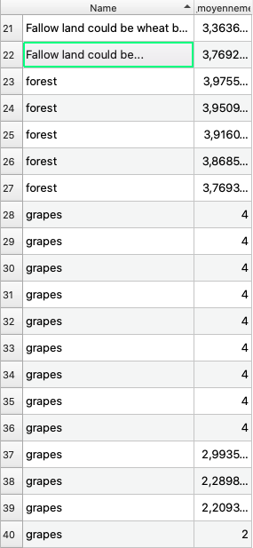

# Classification de l'occupation du sol 

Ce mini-projet a pour but d'explorer quelques possibilités de classification d'occupation du sol de la zone de Bekaa au Liban avec des images optiques et RADAR. Dans ce fichier README, seront expliquées les démarches suivies, avec quelques explications de codes présents dans les liens au-dessus.

Au-delà de la recherche de résultats nous nous attacherons à présenter un cheminement intellectuel : les méthodes utilisées, les résultats obtenus, mais aussi les pistes infructueuses et les difficultés rencontrées. 


## 1- Introduction

La région de la Bekaa est une zone agricole de première importante pour le Liban. Il semble donc primordial de connaitre l'occupation du sol de la région pour quantifier et prévoir les productions et les changements auxquels pourrait être soumis la région. En complément du travail de terrain et de recherches classiques,la télédétection est un outil précieux dans la mesure où elle permet d’analyser le territoire sur de large surface et à une échelle multi-temporelle. Vaste champ, la télédétection peut également s’aborder par différentes composantes comme l’optique et le RADAR ce qui permet de recouper les résultats et d’enrichir l’analyse. 
C’est dans ce contexte que s’inscrit ce mini-projet qui a pour objectif la réalisation de cartes de l’occupation du sol de la région de Bekaa en 2019 à l’aide d’images optiques (Sentinel-2) et RADAR (Sentinel-1). On tachera d'analyser et de comparer les résultats des deux types d'images séparement mais également dans leur complémentarité.


Voici le plan suivi tout au long de ce mini-projet :

je suis meilleur dans le premier, plus facile a comparer ensuite
* Données disponibles et
* Classification des images optiques
* Classification des images RADAR
* Complémentarité des deux méthodes

## 2- Données disponibles, téléchargement et pré-traitement

31 images sur 71 sont à garder sur la zone. 
### Les données de terrains
### Les images Sentinel-2
     - qu'est-ce que l'imagerie optique 
     - (point positif, négatif)
     - pourquoi sentinel-2 
     
     - préparation (téléchargement, prétraitement, difficultés (problème espace, nuage, prétraitement))
     
#### Téléchargement et préparation des données

Les images Sentinel-2 sont disponibles sur plusieurs plateformes de téléchargements comme PEPS ou Sci-hub... Après les avoir téléchargées en prenant en compte différents critères (le taux de nuage dans l'image...) il convient de prétraiter les images et de les découper à la taille voulue avant de les exploiter.
Dans notre cas, le téléchargement et la préparation des données doivent nécessairement être automatisés. En effet, sur l'année 2019, 71 images de Sentinel-2 sur la zone d'étude étaient disponibles. Traiter chacune de ces images séparément semblent être particulièrement long. Cela pose cependant un problème : la plupart des méthodes d'automatisation proposent de télécharger toutes les images et de les traiter ensuite. 
Or, cette entreprise s'avère particulièrement couteuse en espace disque et ne permet pas à mon ordinateur de procéder ainsi. Il a donc été décidé de télécharger chaque date séparément, de traiter les images correspondantes puis de ne garder que le produit fini et de passer à la date suivante.  

Nous nous sommes tournés vers le package `Sen2r` qui remplit parfaitement ce rôle (il peut être téléchargé sur le CRAN avec `install.packages("sen2r")`, voici sa page github : https://github.com/ranghetti/sen2r ). Après s'être connecté à la plateforme Sci-hub, Sen2r permet de sélectionner par code (ou par le GUI `sen2r()`) les images que l'on souhaite traiter. Le package s'appuie entre autre sur les fonctions `s2_download()` pour télécharger les données et ` sen2cor()` pour passer les images de luminance (niveau 1C) en réfléctance (niveau 2A) si besoin (sen2cor n'est pas activé lorsque les images sont téléchargeable directement au niveau 2A). 

Le package Sen2r nécessite que l'on installe sur l'ordinateur les dépendances `Sen2cor` (pour les corrections atmosphériques), `GDAL` (pour les masques de nuages, les buffers...) et `aria2` (pour accélerer le téléchargement des fichiers d'images SAFE *(aria2n'est pas indispensable)*. 

Malgré de nombreux essais, il n'a pas été possible d'installer GDAL sur mon ordinateur Mac (conçu pour windows, aucune solution n'a été trouvé pour l'adapter convenablement). Sans cette dépendance, le code s'arrêtait systématiquement sur une erreur et une solution a dû être trouvée. Aussi, l'explication du code présenté ci-dessous se basera sur la version du code sans Sen2Cor () (code : sen2r_sans_GDAL)


Les dépendances peuvent être téléchargées de plusieurs manières. Voici celles qui ont fonctionné dans notre cas.

Pour sen2cor : `install_sen2cor()`  

Pour aria2 : `brew install aria2` via python 

Pour GDAL : le chargement du package `rgdal` a permis d'éviter une partie des messages d'erreur (tentative d'installation par wine sans succès).


Chargement des packages necessaires : 

`library(raster)` # permet le travail avec des données raster

`library(rgdal)` # permet le travail avec des données vecteur

`library(geojsonlint)` # permet de travailler sur des données GeoJSON 

`library(sen2r)` # permet le téléchargement et le prétraitement des données


Chargement des fichiers SHP et KML pour découper les images. 

```
myextent_1 <- "/Users/hugotreuildussouet/Desktop/zone_liban/vecteur_decoup/zone_liban_sen2r.kml"

zone_liban <- readOGR('/Users/hugotreuildussouet/Desktop/zone_liban/vecteur_decoup/zone_liban.shp')
```

Lorsque les bandes de 20 mètres seront ré-échantillonnées à 10m une zone légèrement plus grande sera tracée afin qu'il n'y ait pas de perte sur les bords (les images seront ensuite redécoupées à la bonne taille). 

`zone_liban_large <- readOGR('/Users/hugotreuildussouet/Desktop/zone_liban/vecteur_decoup/zone_liban_large.shp')`

On peut ensuite passer au téléchargement et aux traitements des données. 
Une boucle passe de jour en jour sur toute l'année 2019 et lance Sen2r lorsqu'il y a des images disponibles sur une date. 
Ci-dessous, on remarque l'utilisation de la fonction trycatch() à chaque utilisation de Sen2r(). On remarque également en début de code l'élaboration de la date issue de la boucle (non présente ici mais que l'on peut retrouver dans le code détaillé). 

Pour Sen2r, on renseigne entre autres les dates souhaitées (ici une date), le pourcentage de nuages tolérés, le format d'images voulut, l'endroit où l'on souhaite entreposer les images... Nous avons remarqué qu'en l'absence de GDAL, la détection des nuages et le découpage des images ne sont pas pris en compte (cette dernière tâche sera donc effectuée plus bas). 

```
 tryCatch({    
    
    date <- paste(annee, mois,jour, sep='-')
    sen2r(
      gui = FALSE,
      apihub = NA,
      downloader = "aria2", 
      max_cloud_safe = 100,
      timewindow = as.Date(date),
      timeperiod = "full",
      extent = myextent_1, 
      extent_name = "sen2r",
      list_prods = "BOA",
      mask_type = "clear_sky",  #  or "cloud_and_shadow"
      max_mask = 10,
      clip_on_extent = TRUE,
      extent_as_mask = TRUE,
      outformat = "GTiff",
      path_l2a = "/Users/hugotreuildussouet/Desktop/zone_liban/1",
      processing_order = "by_groups",
    )
    }, error=function(e){})

```

Une fois le travail de Sen2r terminé, on découpe une première fois les images de cette date (on se base sur le shp "zone_liban" pour les bandes à 10m et le shp "zone_liban_large" pour les bandes à 20m). Les images à 20m sont ensuite reprojetées à 10m puis redécoupées selon le shp "zone_liban". Enfin, les données sont rangées dans un dossier par date. 

Les découpages se font à l'aide de la fonction `crop()`

`bande_coupé <- crop(la_bande,zone_liban)`

Les reprojections des bandes à 20m se font avec la fonction `projectRaster()` qui reprojetent les pixels à 10m et les font concorder spatialement avec ceux des bandes 2,3,4 et 8 par la méthode des plus proches voisins.

`bande_reprojeté <-  projectRaster(bande_1,bande_2,res,crs,method="ngb",alignOnly = FALSE, over = FALSE)`


### Les images Sentinel-1


## 3- Classification de la Bekaa par images optiques
  
### Classifications
2 méthodes de classification (Random forest et technique 2)

#### Random Forest

Comme nous l'avons vu, il y a plus de 20 types d'occupation du sol à classifier et il semble difficile d'obtenir un résultat précis en un seul calcul. L'expérience à tout de même été tentée et a donné raison à cette supposition (l'overall accuracy, qui calcule l'exactitude du modèle était de 0.5 soit une  prédiction très mauvaise). 
Aussi dans un premier temps, il est préférable d'établir une classification plus grossière pour séparer les grands types d'éléments (étape 1). L'idée étant de procéder ensuite à une classification précise de chaque type d'occupation  du sol (étape 2).


##### Etape 1

Rassembler cette vingtaine de types d'occupation du sol en quelques classes plus identifiables peut paraitre simple au premier abord. Il s'agit de les rassembler par ressemblance d'évolutions temporelles de NDVI.
En effet, quatre sortes de sols peuvent être discernées :
1. **les sols agricoles** caractérisés par un NDVI fluctuant entre fort et faible 
2. **les forêts** caractérisées par un NVDI élevé et plutôt constant (ce sont des feuillus)
3. **les espaces en eau** caractérisés par un NDVI très faible 
4. **les sols nus et artificialisés** caractérisés par un NDVI moyen et plutôt constant

Après avoir créé une série temporelle de NDVI, nous allons lancer un Random Forest qui prendra en compte le NDVI minimum, le NDVI maximum et l'amplitude min/max qui permettront de bien différencier chacun des types de sols. 

Derrière ces principes, se pose cependant quelques problèmes :

- Plusieurs classes du fichier de vecteurs n'ont pas d'identité précise et indiquent plusieurs possibilités, tel que *"fallow land could be potato"* ou encore *"onion and potato before"*. Que représentent-elles exactement ?
- Dans quelles catégories seront répertoriées les classes d'arbres fruitiers (pêcher, vigne, cerisier, pommier...) ?  En effet, ce sont des arbres (classe forêt) mais qui peuvent avoir un espacement particulier du fait de leur culture, et qui peut amener à les classer en sols nus ou sols agricoles comme nous pouvons le voir sur l'image google map d'un verger de cerisier ci-dessous. 
<p align="center">

<p>
Afin d'éclaircir ces interrogations, nous avons décidé de classifier la région en 4 classes (eau, sols nus/artificialisés, sols agricoles, forêts) avec de nouveaux polygones non-issus du fichier shp de base (fichier shp de base désigne ici le fichier des relevés de terrain transmis au départ). L'idée étant que la classifiaction issue de ces polygones nous donnera un bon aperçu et une meilleure compréhension de la manière dont seront classés les différents ROIs du fichier de base.  

A l'aide d'image Sentinel-2 et d'images très hautes résolutions de google map, nous avons dessiné des ROIs correspondants à chacun des types vu plus hauts, sur Qgis (plus de 10 ROIs par types). Les NDVI ont été calculés pour toutes les dates ne comprenant pas de neige afin d'avoir le maximum de différence possible sans pour autant que les valeurs ne soient tronquées par la présence de la neige. 
Afin de vérifier que les ROIs créés correspondent bien à la classe pour laquelle nous les avons dessinés, nous en avons dressé le profil temporel sur R. 

On importe les bibliothèques nécessaires

`library(raster)` 
`library(rgdal)` 
`library(ggplot2)` # permet de créer des graphiques 
`library(reshape2)` # permet de travailler sur les dataframe et de les modifier
`library(parallel)` # permet de paralléliser les processus pour en augmenter la vitesse
`library(velox)`    # permet l'extraction raster de manière très rapide


Le code ci-dessous permet ensuite de récupérer les images des bandes 4 et 8 pour chacune des dates (en excluant les 10 premières dates ou la neige présente apportait une confusion) et de créer un NDVI que l'on place ensuite dans un stack. 
On importe également les fichiers vecteurs des quatre types d'occupation du sol.


```
 les_dates <- list.files("chemins vers les dossiers des images", full.names = TRUE)
 le_stack <- stack() 

 for (dates in les_dates[11:31]){
   setwd(dates)
   b <- list.files(".", pattern='B0[4;8]')
   b4 <- raster(b[1])
   b8 <- raster(b[2])
  
   NDVI <- (b8-b4)/(b8+b4)
   le_stack <- stack(le_stack, NDVI)
 }
 
 entrainement <- readOGR(dsn = 'chemin ves le fichier shp',layer = 'nom du fichier')

```
Après avoir séparé les différents types d'occupation du sols () (code : graphique_grands_ensembles), on extrait les valeurs du stack. Il s'agit d'utiliser la fonction `$extract()` de `velox` qui va prendre la moyenne de chaque polygone et la fonction `mclapply` de `parallel` qui va agir comme la fonction `lapply` en exécutant cette extraction pour tous les polygones. 

```
img <- velox(le_stack)
test1 <- mclapply(seq_along(1), function(x){
  img$extract(part, fun=function(t) mean(t,na.rm=T))
})
tab <- as.data.frame(do.call(rbind, test1)) # transforme le resultat de lapply en dataframe 
```
Après avoir transformer le tableau de sortie pour le rendre exploitable, on peut créer les graphiques () (code : graphique_grands_ensembles).
  
<p align="center">

<p>
<p align="center">     

<p>

Après quelques vérifications et suppressions de ROIs qui ne correspondent pas aux classes prévues, il est possible  de passer aux essais de classification.  
 
###### Essaie 1

Nous avons tout d'abords lancé un Random Forest avec le package `randomForest` en prenant en le NDVI minimum, le NDVI maximum et l'amplitude min/max. 

Cependant, cette méthode n'a pas été concluante car elle ne séparait que partiellement ces espaces. L'erreur out of bag (OOB) s'élevait à 21% mais surtout la validation du Random Forest semblait déterminée par les polygones tests, ce qui, après plusieurs essais, pouvait déboucher sur une classification avec 1% d'OOB alors que celle-ci n'était clairement pas satisfaisante... Il est fort probable qu'une donnée nous ait échappé dans la préparation de ce code.  
Pour cette raison, le détail de la méthode ne sera pas détaillé plus que cela mais  (code : optique_RF_1_1)


###### Essaie 2

Il a donc été pensé dans un premier temps que le Random Forest avait surement quelques difficultés avec les sols nus, dans la mesure où la matrice de confusion du premier essai montrait que ce type d'espace était rarement classé correctement (plus de la moitié des pixels).
Cependant, comme le premier essai avait donné des résutats peu cohérents et que cette méthode de classification avait déjà été testée avec succès dans d'autres travaux, il a été jugé nécessaire de persister dans cette voie. 

Au gré des recherches effectuées pour comprendre quelle aurait été l'erreur commise, une autre bibliothèque de classification en Random Forest a semblé intéressante à explorer. 
La package `RStoolbox` s'appuie sur le package `raster`. Il permet d'intervenir sur différents aspects du travail effectué sur des images raster : l'importation de données, la préparation des images, la classification... 
Le code R de la classification issu de ce package est simple, compact et assez rapide (https://bleutner.github.io/RStoolbox/)

Le package est sur le CRAN et peut être installé de la manière suivante :

`install.packages("RStoolbox")` 

Ici vont être détaillés certains morceaux du code de cette classification que l'on peut également retrouver ici. Il reprend des éléments du code du premier essai. 

On importe les bibliothèques nécessaires au bon fonctionnement de la classification 

`library("RStoolbox")` 
`library(raster)`   
`library(rgdal)`  

Nous avons créé un stack de NDVI issu des 21 images sans neige comme cela a été vu plus haut et nous avons importé le fichier shp. Ensuite, tout comme lors du premier essai, nous avons créé des rasters avec les valeurs minimum, maximum et l'amplitude du stack que l'on met dans un autre stack. 

```
NDVImin <- min(stack_NDVI)
NDVImax <- max(stack_NDVI)
amplitude <- NDVImax - NDVImin
stack_max_min_amp <- stack(NDVImin, NDVImax, amplitude)
names(stack_max_min_amp) <- c('Min', 'Max', 'Amplitude')
```

C'est à partir de là que les choses se modifient par rapport à la classification de la bibliothèques randomForest. 
Le random forest est effectué avec la fonction `superClass()`. On lui spécifie les rasters d'entrées, les polygones de tests, la colonne des polygones à prendre en compte (ici l'id permet de séparer les 4 types de polygones), le nombre d'itération, le pourcentage de polygone à utiliser pour l'entrainement (ici 70% des polygones, pourcentage que l'on trouve régulièrement dans la littérature...)

```
test <-   superClass(stack_max_min_amp, entrainement, valData = NULL, responseCol = "id",
                     nSamples = 1000, polygonBasedCV = FALSE, trainPartition = 0.7,
                     model = "rf", tuneLength = 3, kfold = 5, minDist = 2,
                     mode = "classification", predict = TRUE, predType = "raw")
plot(test$map)
test
```

Voici la carte de classification : 


Les résultats sont ici très encourageants. En effet l'overall accuracy qui calcule le pourcentage de pixel bien placé est de 0,961 (sur 1), et l'indice de Kappa qui calcul la part de hasard dans cette classification est de 0,947 (sur 1).  Enfin, les résultats sont significatifs dans la mesure où la p-value est inferieure à 2.2e-16. 

La matrice de confusion quant à elle nous révèle d'intéressantes informations. 
- La classe 1 (l'eau) a été systématiquement bien prédite (tous les pixels de référence eau sont bien placés dans l'eau). Il y a quelques faux-positifs dans la mesure où des pixels de sols ont été classés en eau. 
- La classe 2 (sol/urbain) rencontre plus de problème. En effet 3,7% de ces pixels ont été classés en zone agricole ou forestière et plusieurs pixels agricoles ont été classés comme du sol nu/urbain. 
- La classe 3 (agriculture) est la moins bien classée. 10% de ces pixels ont été classés dans une autre catégorie et quelques pixels ont été classés en tant que sol nu/urbain.
- La classe 4 (forêt) est très bien classée (avec cependant le plus grand pourcentage de faux-positifs). 

```
Confusion Matrix

          Reference
Prediction    1    2    3    4
         1 1001    1    0    0
         2    0  965   43    0
         3    0   24  910    0
         4    0   12   49  358
```
Cette classification nous donne-elle des résultats assez satisfaisants ? La partie la plus importante de ce travail consiste à discriminer les espaces agricoles. Or, avec 10% d'erreur dans cette catégorie, il serait dommage de s'atteler directement à une classification plus précise. Nous allons analyser cette classification pour en tirer des conclusions sur la marche à suivre. 

En effet, cette classification nous apporte des informations sur la manière dont ont été traités les pixels et les polygones de la classification de base (la vingtaine de classes). 
Sur Qgis la classification a été importée et par statistique zonale, nous avons extrait la moyenne des polygones (Qgis étant un meilleur support que R pour la visualisation). 

Ainsi comme on peut le voir sur le tableau ci-contre  
issu de la table attributaire, on peut comprendre dans quelle catégorie ont été classé chaque type (par exemple, les oignons et pommes de terre dans la classe 3 (agricole). 

- La classification des classes aux identités troubles comme *"fallow land could be potato"* est plus enclins aux doutes et les moyennes de 2,60 ou 2,90 témoignent du fait que tous les pixels n'ont pas été catégorisés de la même manière. Dans certaines situations il est tout de même possible de statuer sur leur cas. En effet, si tous les pixels d'un de ces polygones sont classés dans une catégorie, alors il y a de forte chance que le polygone appartienne à cette catégorie. Il ne reste qu'à vérifier leur évolution temporelle sur l'année pour se l'assurer complétement. Dans l'exemple *"fallow land could be potato"* tout en haut de l'image, les pixels de ce dernier ont été classé totalement dans la classe 3 et corrobore l'idée d'un NDVI évoluant comme une culture. On peut donc changer le nom de ce polygone en  *"potato"*. 

- De la même manière la classification des arbres fruitiers est délicate. En effet, dans le cas des arbres pêchers, la moitié des polygones ont l'intégralité de leurs pixels classés dans la classe forêt (classe 4), mais l'autre moitié a une partie de leurs pixels classés dans une autre catégorie. Cela est bien illustré dans l'exemple ci-dessous (foret = vert foncé, sols agricoles = vert clair, sols nus = orange)

<p align="center">
 
</p>
<p align="center">
 
</p>

- Une troisième remarque peut être ajoutée. En effet, comme on peut le voir ci-dessous, certains polygones du fichier de base  chevauchent plusieurs types d'occupation du sols (ici les sols nus et la forêt) et il pourrait être intéressant de les réajuster pour avoir un résultat plus juste. 
<p align="center">
  
</p>

###### Essaie 3

A partir des trois constats observés ci-dessus, il a été décidé de :

- Procéder à une **segmentation des images** à classifier. Pour chaque segment, on appliquera ensuite la moyenne du NDVI pour cette espace. Cela aura pour conséquence de gommer les différences locales et ainsi de faciliter le travail de classification par la suite.

- **Tester le Random Forest avec d'autres critères** que NDVImin, NDVImax et amplitude pour essayer de coller au plus près à l'évolution du NDVI.  

- **Essayer d'augmenter le nombre de polygones** en y incluant certains polygones issus du fichier de base qui peuvent poser problème (en particulier les polygones d'arbres fruitiers dans la catégorie "forêt"). 


D'autres modifications utiles pour plus tard peuvent être faites sur les polygones de base:

- **Renommer correctement les polygones** de base qui peuvent l'être à partir de leur évolution temporelle. 

- **Modifier les contours des polygones de base** lorsqu'il semble évident que plusieurs types de sols se chevauchent.


1) La segmentation 

L'objectif est ici de lisser chaque NDVI avant la classification afin d'obtenir des résultats locaux homogènes.  

La segmentation d'une image consiste à rassembler des pixels qui se ressemblent dans des groupes. Contrairement aux classifications habituelles, il s'agit ici de rassembler des pixels situés dans une continuité spatiale et non pas uniquement basés sur la valeur des pixels. Ce qui nous intéresse dans notre cas est la **meanshift segmentation**, qui permet de créer des segments (ensemble de pixels) renseignant sur la moyenne de ces derniers. On peut utiliser ce modèle sur OTB de Qgis (ce que nous n'avons pas pu faire, en raison des explications proposées plus haut) et quelques plugings R s'y essayent également. Parmi eux msClustering, meanShiftR ou encore OpenImageR et sa fonction superpixels(). Bien que nous ous soyons longuement attardés longtemps sur ces packages et particulièrement le dernier, nous n'avons pas pu obtenir de résultats probants : soit des résultats décevants soit l'absence de résultats. Cela est probablement dû à une incompréhension de notre part à certaines étapes.

Après plusieurs recherches, nous sommes donc revenus à la version normale de Qgis qui propose d'autres types de segmentation et c'est finalement l'outil i.segment de GRASS qui va apporter un résultat satisfaisant (la fonction Watershed Segmentation de SAGA avait bien été tenté auparavant mais sans résultats probants).
On y indique les rasters d'entrées (ici le stack des 21 NDVI) la taille minimale des segments (ici 100 pixels) mais aussi le nombre d'itérations et le seuil de différence. Le résultat généré est un fichier raster segmenté qui semble bien correspondre à la réalité de l'image. Les segments n'ont par contre pas de valeur et sont juste numérotés. Afin d'obtenir les valeurs moyennes du NDVI sur lesquelles sont basées le segment, il faut tout d'abord vectoriser cette carte segmentée. Cette vectorisation a également été réalisée sur Qgis *(Raster > extraction > polygoniser)*. L'extraction peut être faite sur Qgis (via l'outils Zonal statistics) mais dans l'optique de réaliser cette extraction sur chacun des 21 NDVI, mieux valait-il revenir sur R. 

Pour ce faire, nous importons les segmentations rasterisés et vectorisés ainsi que les images nécessaires pour les NDVI. Dans une boucle nous avons créé les NDVI desquels nous avons extrait les valeurs moyennes par segment en utilisant la fonction `$extract()` de `velox` vu plus haut (que l'on applique à partir de la segmentation vectorisée sur le NDVI) . Nous transformons ensuite les résultats en vecteur (qui permet un gain de temps) et remplaçons dans une boucle *for* les valeurs de la segmentation rasterisée par celles des résultats. On obtient donc un meanshift segmentation dont  (code : stack_segmentation)


Les résultats obtenus semblent correspondre aux attentes. Ci-dessous un exemple du meanshift segmentation d'un NDVI comparé à ce même NDVI. 

<p align="center">
 
<p>

Une fois le stack réaliser, nous pouvons de nouveau développer le Random Forest comme vu précédemment, avec la fonction `superClass()` (toujours avec le NDVI minimum, le NDVI maximum mais cette fois-ci avec l'écart-type plutôt que l'amplitude (ce qui apporte une information supplémentaire)), le résultat semble convainquant. 
En effet, l'overall acuracy est de 0,986 et l'indice de Kappa de 0,981.
Quelques pixels forêt ont été classés en sols agricoles et une part plus conséquente de pixels de sols agricoles ont été classés en forêt comme nous pouvons le voir sur la matrice de confusion ci-dessous. Ici, seuls 4.8% des pixels agricoles ont été classés dans une autre catégorie. 

```
Confusion Matrix
          Reference
Prediction    1    2    3    4
         1 1002    0    0    0
         2    0 1002    0    0
         3    0    0  957    3
         4    0    0   46  487
```   

Voici à quoi cette classification ressemble (en bleu l'eau, en jaune le sol nu/zone urbaine, en vert clair les zones agricoles et en vert foncé les forêts).
<p align="center">

<p>
 
Ce résultat semble satisfaisant mais il était intéressant d'essayer d'abord de creuser une autre voie avant de passer à la suite.  


 
2) Mieux tirer parti des évolutions temporelles. 


Jusqu'à présent la classification en Random Forest prenait en compte 3 paramètres : le NDVI minimum, le NDVI maximum et l'amplitude. Cette combinaison est très efficace mais semble perdre une partie de l'information de la série temporelle. En effet, et comme il a déjà été dit, les types d'occupation du sol connaissent des évolutions de NDVI caractéristiques au fil du temps (celles des zones agricoles ressemblent à une cloche, celles des sols nus est plutôt stable et faible, celles des forêts stable et fort...) et il serait intéressant d'utiliser toute l'évolution et pas seulement les indices que sont le minimum, le maximum et l'amplitude. 

Aussi un code a été élaboré pour classifier les zones agricoles en utilisant l'écart de la valeur moyenne des segments (créé avec la segmentation plus haut) par rapport à celles des zones agricoles. Pour que cela fonctionne, il faut dans un premier temps accorder les séries temporelles des espaces agricoles de la même manière (hausse, pic et baisse du NDVI en même temps) car les cultures ne se développent pas au même moment dans l'année. Théoriquement plus l'écart général est faible, plus le segment a une courbe qui se rapproche de celles des zones agricoles et peut être classé comme tel. 

Dans un premier temps donc, il faut accorder les valeurs de NDVI ensemble pour que l'évolution de la végétation concorde. Nous devons le faire pour chaque segment ainsi que pour la courbe d'évolution temporelle 'type' de l'agriculture (issu de polygone qui ont été vérifié comme tel).

Nous avons créé une fonction de roulement qui permet de décaler les valeurs telles une boucle (code trouvé sur internet) 
ex : 'abcde' décalé de 2 vers la droite donne 'deabc'.
```   
shifter <- function(x, n = 1) {
  if (n == 0) x else c(tail(x, -n), head(x, n))
}
```   

Nous avons créé ensuite une fonction qui s'appuie sur shifter() pour recentrer les valeurs de la série temporelle de 21 images (ou 31 si on prend toutes les dates) autour de 11 (la moyenne). A ce rang, nous placerons les valeurs maximums de la série en supposant que les séries se superposeront. 

```  
fonction_centrage <- function(mon_vecteur){
  num <- which(mon_vecteur==max(mon_vecteur))
  med <- 16
  diff <- (med - num)
  col2 <- shifter(mon_vecteur, -diff)
  return(col2)
}
```  

Ci-dessous, un exemple de recentrage de série temporelle des polygones agricoles témoins. On en extrait ensuite la moyenne. Le rendu n'est pas optimum mais suffisamment pour tenter de poursuivre.

<p align="center">

</p>


Pour extraire les valeurs des segments vecteur nous utilisons la fonction  `exact_extract()` du package `exactextractr`. Ce package a été découvert après les travaux précédents et s'avère fort utile. En effet, avec le package `velox`, nous perdons la spatialité dans le calcul et finalement, exactextractr est tout aussi rapide. 

Nous convertissons *vec* en objet sf puis pour chaque segment, il faut extraire la valeur moyenne
```  
vec <- readOGR(dsn = 'chemin_de_la_couche', "segments_ndvi")
vec_sf <- st_as_sf(vec)
vec_sf$valeurs <- exact_extract(stack_NDVI, vec_sf, 'mean')
```  

La fonction `fasterize()` du package `fasterize` permet ensuite de rasteriser un vecteur de manière rapide. 
`nouveau_raster <- fasterize(vec_sff, NDVI, field = "valeurs")`


Une fois chaque NDVI rasterisé et mis dans un stack, il faut extraire le NDVI moyen. Théoriquement, cela donne une carte avec des valeurs de 0 à 1 
(0 = segments à l'évolution du NDVI très proche de celui des terres agricoles témoins, 1 = segments à l'évolution du NDVI très différente de celui des terres agricoles témoins), qui pourrait servir d'indicateur de zones agricoles. 
Cependant, les résultats n'ont pas été à la hauteur de nos attentes et malgré plusieurs essais et combinaisons (l'écart type, la moyenne, le minimum...) la piste a dû être abandonnée...  (code : tentative_1). Il est possible que cet échec s'explique par la variété des types de champs qui n'évoluent pas aux mêmes rythmes (on pouvait déjà le voir sur le graphique plus haut). De plus à une date T, l'écart entre les valeurs de NDVI témoins et celles de l'image peut pour plusieurs raisons diverger et augmenter significativement l'écart moyen. La méthode des NDVI minimum, maximum et écart-type est moins sensible à ce genre d'erreur. De ce fait, nous allons rester sur cette première méthode. Cette tentative nous aura tout de même permis de découvrir de nouveaux packages très utiles. 


3) Augmenter le nombre de polygones

L'idée consistait à incluant certains polygones issus du fichier de base qui peuvent poser problème, en particulier les polygones d'arbres fruitiers comme les cerisiers, les pêchers... Cependant, après avoir observé les séries temporelles de ces derniers, cela ne semble pas si judicieux. En effet, le NDVI moyen de ces arbres est assez variable et les utiliser comme polygones témoins apporterait surtout une confusion dans la classification.


4) Renommer correctement les polygones de base

Cela s'applique principalement aux polygones type *"fallow could be wheat"*. On observe les courbes de leurs évolutions temporelles et on compare à des poylgones de chaque type (dans l'exemple, *fallow* et *wheat*), ce qui permet ensuite de décider s'il s'agit de l'une ou de l'autre. 
Dans le graphique ci-dessous (de gauche à droite : *fallow could be...*, *"potato"*, *"wheat"*) il est immédiatement possible de voir quelle courbe de *"fallow could be..."* va dans telle ou telle catégorie (pour la plupart des polygones).

<p align="center">

</p>

En revanche, il est surprenant de constater que de nombreux polygones *"fallow could be wheat"* sont en réalité des pommes de terre, et *"fallow could be potato"* du blé... Ci-dessous par exemple, seule une, voire deux courbes semblent représenter effectivement la pommes de terre... 

<p align="center">

</p>
Les deux derniers éléments présents dans *"fallow could be..."* n'ont pu être classés dans aucune catégorie (y compris en observant la vingtaine d'autres). De ce fait, il a été décidé de les garder comme tels et éventuellement de les supprimer s'ils posent problème ultérieurement. 

D'autres éléments ont paru suspect, notamment dans la catégorie *"fallow"*. En effet comme on peut le voir sur le graphique ci-dessous, les courbes se ressemblent à l'exception d'une qui présente un pic en juin et non en début d'année. De ce fait, cette courbe a été déplacée dans la catégorie *"fallow could be..."* pour l'instant (la forme de la courbe en question ressemble à celle d'un des pêchers mais avec une valeur moins forte. Il semblerait cependant impossible de confondre les deux espèces lors du travail de terrain, prudence...).
<p align="center">

</p>

Dans la catégorie *"grapes"*, un des polygones a une courbe qui s'approche beaucoup plus de celles des sols nus que de celles des vignes comme on peut le voir ci-dessous (en rouge : la moyenne des sols nus, en bleu : la moyenne des vignes, en vert : la vigne suspecte). Il pourrait réellement s'agir d'une parcelle de vigne (en mauvais état) comme nous l'indique l'analyse de la vue Googlemap, mais la confusion qu'elle apporterait lors de la classification nous oblige à la supprimer pour l'instant (lors de l'analyse radar, peut-être pourrons nous la réintégrer).

<p align="center">

</p>


La parcelle *"small forest"* n'a pas les caractéristiques d'une forêt. Son NDVI maximum est en deçà de 0.8, son NDVI minimum de 0.3 et sa moyenne de 0.5. Il serait donc difficile de le placer dans la catégorie *"forest"*. Nous n'y touchons pas pour l'instant mais cette catégorie pourrait être éliminée à l'avenir.
De même, les catégories *"cherry"*, *"vegetables in nets"* et *"small fruit tree"* en plus de n'avoir qu'un polygone chacun, n'ont pas de série temporelle représentative, et il sera peut-être nécessaire de les écarter également de la classification. Voici ci-dessous leurs séries temporelles dans leur ordre respectif.

<p align="center">

</p>

Deux parcelles de *"zuchini"* possèdent des caractéristiques plus proches du sols nus que de sols agricoles comme on peut le voir ci-dessous (en gras rouge : moyenne des sols nus, autres : polygones des courgettes dont deux en bleu et violet ressemblent au sol nu). Il est préférable de les mettre également de côté. 

<p align="center">

</p>

Enfin, un commentaire peut être fait sur les parcelles *"potato"* et *"wheat"*. Ces catégories possèdent de nombreux polygones et bien que la plupart aient une évolution temporelle similaire, certains polygones connaissent des trajectoires assez singulières. Il a été décidé de les conserver car il s'agit surement de culture de saison différente, mais cela rend difficile d'établir une trajectoire type. 


5) Modifier les contours de polygones 

Nous inspecterons les polygones du fichier de base qui ne devraient pas normalement poser trop de problème mais dont les résultats sont imprécis. Nous modifierons ensuite ces polygones.  


Conclusion :

Le travail réaliser sur ces cinq étapes a permis d'améliorer significativement les résultats et la plupart des polygones de base sont bien classés dans les quatres catégories que sont les espaces en eaux, les sols nus, les sols agricoles et les forêts. La segmentation a joué un grand rôle dans cette amélioration.  
Cependant, même si cela reste relativement rare, la segmentation peut parfois tronquer les valeurs des ROIs : deux polygones représentants des choux par exemple ont été classés comme sols nus sur la classification segmentée mais comme terres agricoles sur la classification non segmentée. Le segment dans lequel sont présents ces deux polygones a été constitué en majorité par les sols nus avoisinants.

De plus, on peut déplorer encore un manque de précision au niveau des zones agricoles. En effet, et comme nous l'avons dit précédemment, afin d'éviter les zones enneigéees, seules les dates allant du 31 mai à fin décembre 2019 ont été prises en compte à cette étape. Or, certaines cultures d'hiver connaissent leur pic de NDVI en début d'année avant de décroitre rapidement et ressembler à un sol nu le reste de l'année, ce qui engendre évidemment des erreurs (à cette étape, l'utilisation d'un masque issu d'un NDSI (indice de détection de la neige) n'a pas pu améliorer la classification car cela fragilisait fortement les résultats).

Il est important de préciser que pour la classification détaillé, il n'est pas tant important de classé l'espèce dans la bonne classe que de faire en sorte que toutes les parcelles d'une même espèce soit dans la même classe. 


###### Essaie 4

A partir des conclusions établies lors de l'essai précédent, et avant de passer à la classification détaillée, voici ce qui a été décidé :  

Les problèmes liés à la courte **période d'étude** nous montrent la limite de la classification unique. Nous allons utiliser la classification existante et créés quatre masques correspondants aux quatre types d'occupation du sol. Nous reclassifierons ensuite spécifiquement chacune des catégories avec les images en jouant sur les différents lapses de temps (tantôt les 21 images,tantôt 31...) afin d'y détecter les "intrus" qui seront ensuite rediriger vers leurs catégories. 
La **segmentation** pourra être modifiée elle aussi lors de cette étape. Cela permettra aux polygones mal classés en raison de la segmentation d'être reclassés différemment si besoin.

Concrêtement, à partir de la première classification nous avons créé un masque de sols nus, un autre de terres agricoles et un dernier de forêts (l'eau ayant été très bien classée lors de la première classification n'a pas à l'être de nouveau). Nous multiplierons ensuite ces masques par le stack de NDVI. 


`setwd('/Volumes/Treuil Data/reclassif/')`  #on importe le raster des classification
`classif <- raster('classification_1.envi')` 

` agri <- classif==3 `  # création d'un masque binaire des zones agricoles et non agricoles (3 étant ici le numéro des zones agricoles).
` agri[agri==0] <- NA`  # On modifie la valeur *0* des zones non agricoles en valeur *NA*
`agri_stack <- agri*stack_NDVI` # on multiplie le stack avec le masque.


Pour chacun des types d'occupation du sol,nous créons ensuite un fichier vecteur shp ou l'on renseigne les segments mal classés. Cela se fait par une analyse visuelle de la zone. Il faut essayer de comprendre pourquoi les erreurs surviennent. On s'aperçoit par exemple que tel sol nu a un NDVI fort en début d'année et que si on souhaite pouvoir le distinguer des terres agricoles (qui en soit ont donc les mêmes valeurs minimales et maximales) il faut supprimer les x premières dates du stack servant à la classification. De même, pour permettre aux parcelles de choux d'être bien classées en zones agricoles (ce qui n'est pas le cas en raison de la segmentation), on peut par exemple réaliser une seconde classification en utilisant le stack des NDVI non segmenté. On peut alors assigner les valeurs de cette nouvelle classification à l'ancienne classification.  

Prenons un exemple : la première classification des zones agricoles issue du stack de NDVI segmentés ne convient pas parce qu'elle ne prend pas en compte les choux. Il est possible alors de recréé un stack de NDVI non segmenté uniquement à partir de la catégorie agricole de la première classification. Nous lançons le Random Forest (qui s'appuie sur des polygones dessinés à partir des erreurs dans la zone du masque) et tous les nouveaux pixels agricoles sont ajoutés à ceux de la première classification de cette manière :

`classif_agri[classif_2 == 3] <- 3`

Nous passons ensuite à la détection des "intrus" de l'occupation du sol suivante. Pour avoir un maximum de précision, plusieurs roulements de re-classifiaction ont été effectués. 


On pourrait reprocher à cette méthode de multiplier les calculs et classifications, ce qui risquerait de diminuer la précision de ces derniers (en effet, l'indice de Kappa qui mesure le "degré de chance" pour que cette classifiction soit correctement classée est toujours bas ce qui signifie qu'il est scientifiquement difficile de juger de sa qualité). 

Cependant, cette méthode est robuste et un des éléments ne trompe pas : En effet, alors qu'aucun des fichiers de polygones utilisés dans ces classifications n'a été confronté aux polygones de bases (la couche avec la vingtaine de types d'occupation du sol), on peut constater que la classification finale réunit parfaitement bien les polygones des mêmes types d'occupation du sol. 
 
 Ci-dessous, la statistique zonale des valeurs moyennes des polygones, effectuée sur la classification finale (réalisée sous Qgis) : la plupart des ROIs des mêmes catégories sont classés ensemble. Il y a parfois quelques pixels mal classés (et deux polygones de blé classés en sols nus) mais l'ensemble est très acceptable. 
 
<p align="center">
      

<p align="center">
    
</p>
 
 
Une exception subsiste tout de même : comme on peut le voir, les vignes sont difficilement classables. Elles apparaissent tantôt comme de la forêt, tantôt comme du sol nu.
 
Cela est dû à la grande variabilité des séries temporelles de vignes comme on peut le voir sur la série temporelle ci-dessous, où certaines parcelles vont avoir des amplitudes de 0.2 point de NDVI et d'autre 0.5, avec des extrêmes également très divers. Il est préférable de ne pas s'entêter. Pour la prochaine partie, l'idée est que les vignes seront classé deux fois (dans forêt et dans sols nus) puis regroupé
Si ce n'est pas avec leurs valeurs qu'il sera possible de les distinguer, certaines autres idées basées notamment sur la forme des courbes, pourront être évoquées dans la partie suivante.

<p align="center">
 
</p>


Quoi qu'il en soit, voici la classification finale des grands ensembles de types d'occupation du sol. Il est maintenant possible de réaliser une classification plus pointue (l'image occupe trop de place pour être hébergée directement sur Github, mais il ne faut hésiter à demander par mail les données).
 
<p align="center">

<p>


##### Etape 2


Dans cette étape, nous allons affiner la classification établi avec la segmentation des NDVI sous Random Forest. Nous avons réussit avec succès à créer quatres sous-groupes pou distinguer plus facilement la vingtaines d'occupation du sols existente. Pour obtenir une classification de ces sous groupes, nous allons toujours tenté dans un premier temps de les identifié en classifiant par Random Forest tout le sous-groupe. Cependant, et comme cela est déjà arrivé, cette méthode peut ne pas porter ces fruits et nous nous appuyerons alors sur les particilarités des courbes temporelles des milieux, et du nombre de polygones disponible à chaque fois. Les types d'occupation du sols seront alors trouvés un par un. 


###### Les espaces en eaux

De loin le type d'occupation du sol le plus facile à extraire. Les espaces en eaux sont en effet seul dans leur sous-catégories.


###### Les sols nus 

Dans la catégorie sols nus nous retrouveons déjà plus d'éléments : *fallow land*, *grapes*, *olives*, *onions*, *urban*, *wheat*, *zuchini* et  *small fruit tree*
Paradoxalement, aucuns polygones de sols nus n'a été dessiné dans ce jeu de donnée, ce qui s'en rapproche le plus étant les jachères. Il a été jugé utile de rajouter cette catégorie. 

Il est nécessaire de modifier la méthode de classification par Random Forest. En effet, le NDVI minimum, maximum et l'amplitude étaient de très bons indices pour trouver les grandes catégories mais ne suffisent plus au stade actuel. Afin de trouver la bonne méthode de classification, les séries temporelles de chaque type d'occupation du sol ont été dressés. Les voici : 

<p align="center">
      
     
<p align="center">
      
     
<p align="center">
  
<p>

Avant de chercher la meilleure manière d'utiliser le Random Forest, il faut résoudre trois problèmes qui risquerait de tronqué la classification : 

1 - Comme on peut le voir sur le graphique des vignes, et contrairement aux autres éléments, il est très compliqué d'en tirer un profil temporel type. En effet, l'amplitude des courbes est grande et suivent à certaines périodes des trajectoires très hétérogènes. Cela pose problème car aucune classification ne pourrait classer ensemble toutes ces courbes et l'abscence de classification risque de fausser les résultats suivants. Pour cette raison, il a été décidé de comparer ces courbes de vignes à tous les autres types de sols afin de trouver à chaque fois une spécificité propre aux vignes. Nous avons conscience que cette méthode n'est pas optimale mais semble être la seule solution dans notre cas (se dessine déjà l'apport des images RADAR qui pourrait peut être permettre de travailler sur la texture de l'image, fort utile pour les vignes). 

Voici comme cela fonctionne : pour chaque particularité, on crée un masque correspondant et tous les masques sont multiplié ensemble à la fin. 
Par exemple, ce qui distingue le mieux les parcelles de vignes de celles des courgettes est la différence dans l'amplitude des valeurs entre la 14ème date et la 25ème date. Cette particularité des vignes par rapport aux courgettes peut donc permettre de crée un masque qui représente *tous les pixels dont l'amplitude entre la 14ème et la 25ème date ne dépasse pas 0.20 point de NDVI*. Afin de lisser le résultat, on utilise un calcul de morpho-mathématique de dilatation érosion avec une fenêtre coulissante de 9 pixels (à gauche avant le morpho-math, à droite après le morpho-math).


<p align="center">
   
<p>


Les résultats sont très satisfaisants. Sur les 10 polygones de vignes, 7 ont été parfaitement classé et les trois autres oscillent entre 60 et 80% de pixels bien classés. Sur le rendu final, certaines parcelles classées comme vigne ont été vérifiées sur Google map et dans la grande majorité des cas l'image correspondait aux rangées de vignes. Certains autres polygones ont eut des pixels classés également en vigne mais dans de faible proportion (4 polygones précisément, avec 0,07 à 0,18% des pixels classés comme vigne). 


2 - La classification par Random Forest nécessite pour être valable d'avoir un certains nombres de polygones pour entrainer le modèle et procéder également aux vérifications. Or nous ne disposons pas du nombre de ROIs suffisants pour les catégories *olives*, *small fruit tree* et les deux polygones *wheat* classé ici, avec respectivement : deux, un, et deux polygones chacuns. Nous allons donc les traiter de la même manière que la catégorie *grapes*. 

Après essai, il s'est avéré non pertinent de classifier le polygone *small fruit tree*, car en dehors du polygone de test, aucun autre champs n'a pu être classé correctement (en vérifiant sur google map). La classification du blé a été maintenu car elle proposait quelques résultats intéressant sans être parfais et celle des oliviers s'est révelé pertinente. 


3 - Comme on peut le voir sur le graphique plus haut, la classe *oinion* est composée de trois champs dont un a une évolution temporelle très différente des deux autres. Cela s'explique surement par le fait que l'on a affaire à une culture d'été et d'hiver. Il est impossible donc de distinguer une évolution type de cette catégorie. On procédera donc à deux classification qui seront ensuite réunit (on peut remarquer également deux types de cultures de courgettes mais elles possèdent de nombreux points communs, ce qui explique qu'on ne les traite pas séparement). Pour ce faire nous allons employé la même méthode que celle utilisé pour les quatres premières catégories. 


Avec les quatres catégories restantes (*fallow*, *desert*, *urban*, *zuchini*), et après avoir examiné leur courbes d'évolution, il a été décidé de tenté un Random Forest basé sur le NDVI minimum, le NDVI maximum et l'écart type. 


1. **les sols nus et artificialisés** 
2. **les sols agricoles** (blé, alfalfa, choux, chou-fleur, haricot, oignon, laitue, courgette, tomate, pomme de terre, jachères)
3. **les forêts** 
4. **les espaces artificialisés** (zones urbaine, serres)
5. **les espaces en eau** 

> Selon Hale Hage Hassan & all (Les changements d’occupation des sols dans la Béqaa Ouest (Liban) : le rôle des actions anthropiques, 2019) d'autres éléments tel que les broussailles sont présents dans la région mais il semble que cela puisse être confondus avec les espaces en jachères.


